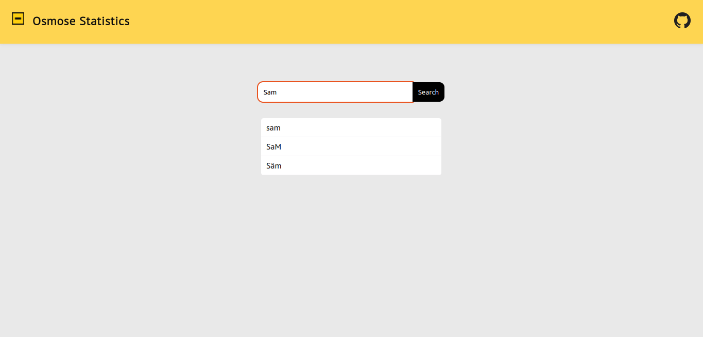
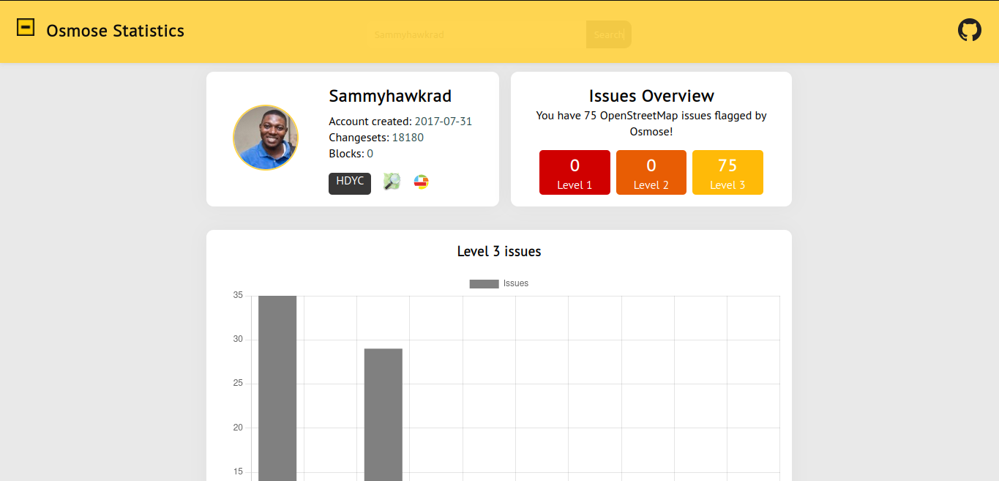

# OsmoseStats

This website is a page to give you a summary statistics of issues with your OpenStreetMap
contributions as flagged by Osmose.

### Search for username

Simply enter your OSM username in the search bar and press enter, then select the correct
username from the results. For people who have changed usernames in the past, an old username
may pop up due to the API used.

### Select and view statistics

Select the OSM username and see statistics for the contributor

## License

MIT License

Copyright (c) 2022 Samuel Darkwah Manu